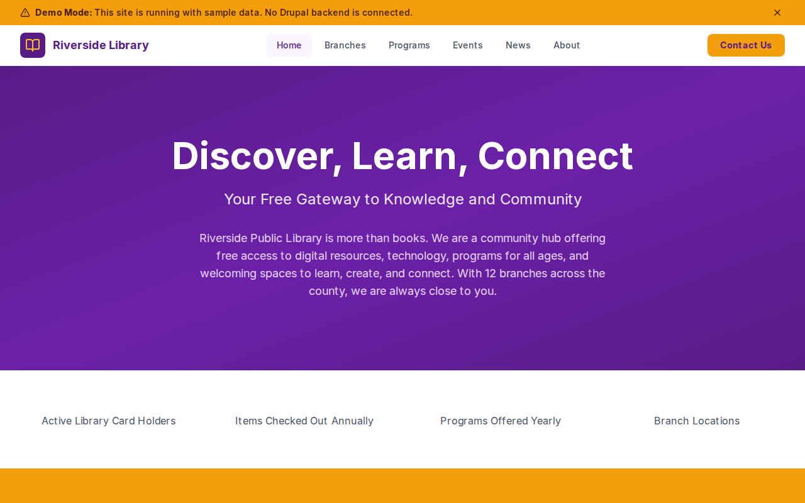

# Decoupled Library

A professional website starter for public libraries, community libraries, and library systems. Built with Next.js 15 and Drupal CMS, this starter showcases branch locations, programs, events, and news to help libraries connect with their communities and promote services.



[](https://vercel.com/new/clone?repository-url=https://github.com/nextagencyio/decoupled-library&project-name=library-site)

## Features

- **Branches** -- Display library branch locations with addresses, hours, phone numbers, features, meeting rooms, parking, and accessibility information
- **Programs** -- Promote recurring programs and classes with schedules, age groups, branch locations, and registration details
- **Events** -- List upcoming events like author visits, book sales, and workshops with dates, locations, and registration links
- **News** -- Publish library news, announcements, and updates with categories, authors, and summaries
- **Homepage** -- Welcoming hero section, library statistics (cardholders, checkouts, programs, branches), featured programs, and library card CTA
- **Basic Pages** -- Static content for About, Library Card information, and more

## Quick Start

### 1. Clone the template

```bash
npx degit nextagencyio/decoupled-library my-library-site
cd my-library-site
npm install
```

### 2. Run interactive setup

```bash
npm run setup
```

This interactive script will:
- Authenticate with Decoupled.io (opens browser)
- Create a new Drupal space
- Wait for provisioning (~90 seconds)
- Configure your `.env.local` file
- Import sample content

### 3. Start development

```bash
npm run dev
```

Visit [http://localhost:3000](http://localhost:3000)

---

## Manual Setup

If you prefer to run each step manually:

<details>
<summary>Click to expand manual setup steps</summary>

### Authenticate with Decoupled.io

```bash
npx decoupled-cli@latest auth login
```

### Create a Drupal space

```bash
npx decoupled-cli@latest spaces create "Riverside Public Library"
```

Note the space ID returned (e.g., `Space ID: 1234`). Wait ~90 seconds for provisioning.

### Configure environment

```bash
npx decoupled-cli@latest spaces env 1234 --write .env.local
```

### Import content

```bash
npm run setup-content
```

This imports the following sample content:

**Branches:**
- Main Library (100 Library Plaza -- historic Carnegie building, 45,000 sq ft, auditorium, digital media lab)
- Eastside Branch (4500 Eastview Drive -- LEED-certified, STEAM Lab, drive-through pickup)
- Westpark Branch (2200 Westpark Avenue -- mid-century charm, homework help center, used bookshop)

**Programs:**
- Baby Storytime (ages 0-24 months -- rhymes, songs, fingerplays, Tuesdays & Thursdays)
- Teen Coding Club (ages 13-17 -- Python, web development, app design, Wednesdays)
- Tech Help for Seniors (ages 55+ -- smartphones, email, video calling, Mondays & Fridays)

**Events:**
- Author Visit: Elena Torres Discusses 'The River Between Us' (April 10, 2026)
- Summer Reading Program Kickoff Party (June 7, 2026)
- Friends of the Library Spring Book Sale (April 24-26, 2026)

**News:**
- Expanded Sunday Hours at Three Branch Locations
- Library Launches Three New Digital Collections
- Summer Reading Program Sets New Participation Record

**Pages:**
- About Riverside Public Library
- Get a Library Card

</details>

## Content Types

### Branch
| Field | Type | Description |
|-------|------|-------------|
| title | string | Branch name |
| body | rich text | Branch description and highlights |
| address | string | Street address |
| phone | string | Phone number |
| hours_weekday | string | Weekday hours |
| hours_weekend | string | Weekend hours |
| branch_features | string[] | Available features and amenities |
| meeting_rooms | boolean | Meeting rooms available |
| parking | string | Parking information |
| accessibility | string | Accessibility features |
| image | image | Branch photo |

### Program
| Field | Type | Description |
|-------|------|-------------|
| title | string | Program name |
| body | rich text | Program description |
| program_type | term[] | Type of program (Storytime, Book Club, etc.) |
| age_group | term[] | Target age group |
| schedule | string | Recurring schedule |
| branch_location | string | Where the program is held |
| registration_required | boolean | Whether registration is needed |
| registration_url | string | Registration link |
| image | image | Program photo |

### Event
| Field | Type | Description |
|-------|------|-------------|
| title | string | Event name |
| body | rich text | Event description |
| event_date | datetime | Start date and time |
| end_date | datetime | End date and time |
| location | string | Event location |
| event_category | term[] | Event type (Author Visit, Workshop, etc.) |
| age_group | term[] | Target age group |
| registration_required | boolean | Whether registration is needed |
| registration_url | string | Registration link |
| image | image | Event photo |

### News
| Field | Type | Description |
|-------|------|-------------|
| title | string | Article headline |
| body | rich text | Full article text |
| news_category | term[] | News category |
| publish_date | datetime | Publication date |
| author | string | Article author |
| summary | rich text | Brief summary |
| image | image | Featured image |

### Homepage
| Field | Type | Description |
|-------|------|-------------|
| hero_title | string | Main headline |
| hero_subtitle | string | Supporting tagline |
| hero_description | rich text | Hero body copy |
| stats_items | paragraph[] | Library statistics |
| featured_items_title | string | Featured section heading |
| cta_title | string | Call-to-action heading |
| cta_description | rich text | CTA body copy |
| cta_primary / cta_secondary | string | CTA button labels |

## Customization

### Colors & Branding
Edit `tailwind.config.js` to customize the purple and amber color scheme. Update the Header component logo and library name.

### Content Structure
Modify `data/library-content.json` to add or change content types and sample content.

### Components
React components are in `app/components/`. Key files:
- `HomepageRenderer.tsx` -- Landing page with hero, stats, and CTA
- `BranchCard.tsx` / `ProgramCard.tsx` -- Branch and program listing cards
- `EventCard.tsx` / `NewsCard.tsx` -- Event and news listing cards
- `Header.tsx` -- Navigation and branding

## Demo Mode

Demo mode allows you to showcase the application without connecting to a Drupal backend.

### Enable Demo Mode

```bash
NEXT_PUBLIC_DEMO_MODE=true
```

### Removing Demo Mode

1. Delete `lib/demo-mode.ts`
2. Delete `data/mock/` directory
3. Delete `app/components/DemoModeBanner.tsx`
4. Remove `DemoModeBanner` from `app/layout.tsx`
5. Remove demo mode checks from `app/api/graphql/route.ts`

## Deployment

### Vercel (Recommended)
[](https://vercel.com/new/clone?repository-url=https://github.com/nextagencyio/decoupled-library)

Set `NEXT_PUBLIC_DEMO_MODE=true` in Vercel environment variables for a demo deployment.

### Other Platforms
Works with any Node.js hosting platform that supports Next.js.

## Documentation

- [Decoupled.io Docs](https://www.decoupled.io/docs)
- [Next.js Documentation](https://nextjs.org/docs)
- [Drupal GraphQL](https://www.decoupled.io/docs/graphql)

## License

MIT
